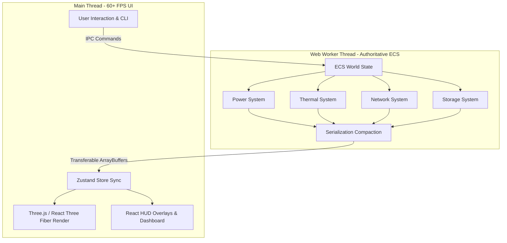

# Infra-Tycoon Operational Digital Twin Simulator: Enterprise User Guide
### Version 2.2 | Production-Grade Datacenter Infrastructure Operations Manual

---

## 1. System Architecture & Platform Overview

### 1.1 Architecture Design: Decoupled ECS & Simulation Worker
**Infra-Tycoon** is an enterprise-grade datacenter operational digital twin simulator designed to model thousands of racks, network cables, storage fabrics, and physical thermal zones with absolute mathematical determinism.

To achieve fluid, lag-free 3D rendering (stable above 60 FPS) while executing complex thermodynamic, electrical, and network routing physics, the simulator uses a fully decoupled **Entity-Component-System (ECS)** architecture split across thread boundaries:
- **Background Simulation Worker (Web Worker)**: The authoritative ECS compute engine. It runs the entire physics loop (Power, Thermal, Network, and Storage Systems) in a separate worker thread. All state updates are processed sequentially and compacted before being serialized into lightweight transferable ArrayBuffers to prevent main-thread blockages.
- **Main Rendering & UI Thread (React + Three.js / React Three Fiber)**: The presentation layer. It consumes compacted state snapshots pushed from the simulation worker, manages user interactions, renders high-fidelity 3D assets, and processes the HUD overlay.
- **Zustand Fragmented Stores**: Coordinates logical frontend state, utilizing granular selectors to minimize React component re-renders.



### 1.2 Deterministic Execution & Thread Synchronization
The simulation loop runs independently of the client's display frame rate. It evaluates elapsed time (`dt`) deterministically, ensuring that calculation results are identical across varying hardware and future multiplayer synchronizations. 
- **Backpressure Guard**: If the background worker thread is busy when a new tick is fired, subsequent ticks are queued or dropped to prevent thread congestion and accumulation latency.
- **Cache-Aligned ECS Queries**: Component queries are cached to achieve O(1) retrieval times, bypassing expensive graph traversal on every tick.

### 1.3 Telemetry, Tracing, and Alerting Infrastructure
The platform features integrated enterprise observability subsystems that compile diagnostic data across the datacenter fabric:
- **Prometheus OpenMetrics Exporter**: Aggregates site metrics into standard OpenMetrics formatted gauges, exposing facility power PUE, network throughput, storage capacities, and hot-node counts.
- **Transaction Tracer**: Records span transactions (success, failure, or warning) for operations like node boot sequences, software installations, and link routing.
- **Observability Alerting Registry**: A rules engine that automatically evaluates telemetry boundaries, publishing severity-coded alerts (`info`, `warning`, `critical`) to the NOC dashboard.

---

## 2. Asset & Hardware Procurement Catalog

Datacenter operators configure facilities by procuring standard 19-inch rackmount equipment. The catalog includes specialized configurations across compute, storage, networking, security, identity, and facilities.

| Model / Key | Type | Form Factor | Power Profile | Storage | Port Layout | Enterprise Use Case |
| :--- | :--- | :--- | :--- | :--- | :--- | :--- |
| **Server Rack** <br>`RACK_42U` | Rack | 42U | 0 W | - | - | Standard enterprise rack providing 42U of slotted rails and an integrated power bus bar. |
| **Blade Chassis** <br>`BLADE_CHASSIS_4U` | Compute | 4U | 500 W | 0 TB | 4x `pwr`, 8x `fabric` | Consolidates power feeds and high-speed network backplanes for up to 8 modular blade servers. |
| **Blade Server** <br>`BLADE_SERVER` | Compute | 0U | 200 W | 1 TB | 2x `vnic` | High-density compute node designed to slide directly into a parent Blade Chassis. |
| **GPU Node** <br>`GPU_NODE_2U` | Compute | 2U | 1200 W | 4 TB | 2x `pwr`, 4x `eth` | High-performance chassis optimized for AI/ML training, featuring extreme thermal output. |
| **Compute** <br>`COMPUTE_1U` | Compute | 1U | 300 W | 2 TB | 2x `pwr`, 3x `eth` | General purpose application hosting (web services, APIs, directory proxies). |
| **SAN Controller** <br>`SAN_CONTROLLER_2U` | Storage | 2U | 600 W | 50 TB | 2x `pwr`, 4x `fc` | Storage virtualization intelligence. Manages LUN slices, snapshots, and block-level replication. |
| **Disk Shelf** <br>`DISK_SHELF_2U` | Storage | 2U | 300 W | 200 TB | 2x `pwr`, 2x `sas` | Capacity expansion shelf containing high-capacity SAS hard disk drives. |
| **NVMe Flash Array** <br>`NVME_ARRAY_1U` | Storage | 1U | 400 W | 100 TB | 2x `pwr`, 2x `eth` | High-throughput, ultra-low latency solid-state storage array for fast database transaction nodes. |
| **Leaf Switch** <br>`LEAF_SWITCH_1U` | Network | 1U | 150 W | 0 TB | 2x `pwr`, 48x `Gi1/0/` | Top-of-Rack (ToR) network aggregation. Connects node interfaces to the datacenter fabric. |
| **Spine Switch** <br>`SPINE_SWITCH_2U` | Network | 2U | 400 W | 0 TB | 4x `pwr`, 32x `Hu1/0/` | Core distribution switch. Interconnects Leaf Switches to build a high-performance spine-leaf fabric. |
| **VPN Gateway** <br>`VPN_GATEWAY_1U` | Network | 1U | 100 W | 0 TB | 1x `pwr`, 4x `eth` | Handles encrypted site-to-site tunnels and authenticated external serial console gateways. |
| **NG-Firewall** <br>`NG_FIREWALL_1U` | Security | 1U | 200 W | 0 TB | 2x `pwr`, 6x `eth` | Deep Packet Inspection (DPI) security appliance. Filters malware and contains ransomware spreads. |
| **SIEM Collector** <br>`SIEM_COLLECTOR_1U` | Security | 1U | 250 W | 10 TB | 2x `pwr`, 2x `eth` | Centralized log aggregator and security audit logging manager for compliance tracking. |
| **IDS/IPS Node** <br>`IDS_IPS_NODE_2U` | Security | 2U | 300 W | 0 TB | 2x `pwr`, 4x `eth` | Intrusion Detection and Prevention system. Actively drops malicious packets. |
| **Directory Server** <br>`DIRECTORY_SERVER_1U` | Identity | 1U | 200 W | 1 TB | 2x `pwr`, 2x `eth` | Domain identity provider. Handles centralized AD/LDAP logins and access control lists. |
| **HSM Module** <br>`HSM_MODULE_1U` | Identity | 1U | 150 W | 0 TB | 2x `pwr`, 2x `eth` | Hardware Security Module. Provides cryptographic acceleration and tamper-proof key storage. |
| **High-Density PDU** <br>`HIGH_DENSITY_PDU_1U`| Facility | 1U | 50 W | 0 TB | 24x `out` | Expands rack-mount power capabilities up to 15 kW, providing 3-phase balancing lines. |
| **In-Row CRAC** <br>`IN_ROW_CRAC_4U` | Cooling | 4U | 5000 W | 0 TB | 2x `pwr` | Air conditioning system generating -50,000 BTU cooling to neutralize rack micro-climates. |

---

## 3. Core Simulation Subsystems

```
    ┌────────────────────────────────────────────────────────┐
    │                 ECS World Physics Loop                 │
    └────────────────────────────────────────────────────────┘
                                │
        ┌───────────────────────┼───────────────────────┐
        ▼                       ▼                       ▼
  [Power System]        [Thermal System]        [Network System]
  - 3-Phase Balancing   - Micro-climates        - Dijkstra Routing
  - UPS Discharge/Charge - Aisle Containment     - QoS Queue Delays
  - Breaker Tripping     - Silicon Safeguards    - Link Saturation
```

### 3.1 Thermodynamic & Cooling Systems
Datacenter cooling relies on managing local temperatures to prevent silicon failure. The simulator models fluid thermodynamics at three distinct granularities: server chassis, rack micro-climates, and site room ambient zones.

#### Localized Rack Micro-Climates & Containment
Each rack behaves as an isolated thermal zone. Heat rejected by cabled servers aggregates into a net BTU load, warming the rack's micro-climate above the room's ambient temperature.
- **Aisle Containment Configurations**: Operators can install containment panels to modify convective air exchange:
  - `none` (Open Air): 50% recirculation fraction (`RECIRCULATION_NONE`). Server exhaust air escapes back into the cold intake, increasing temperatures.
  - `cold_aisle`: 5% recirculation fraction (`RECIRCULATION_COLD_AISLE`). Restricts convective mixing, keeping rack intake temperatures very close to ambient.
  - `hot_aisle`: 15% recirculation fraction (`RECIRCULATION_HOT_AISLE`). Redirects hot exhaust back to CRAC return channels, providing highly efficient cooling.
- **Bypass Airflow & Blanking Panels**: Unoccupied rack slots that do not have blanking panels installed cause airflow bypass leaks. Each empty open slot cuts cooling efficiency by 5%, modeled as:
  $$\text{Bypass Airflow Factor} = \max(0.1, 1.0 - 0.05 \times \text{emptySlotsWithoutPanels})$$

#### Ambient Inertia & Convective Heat Exchange
Site rooms model large thermal inertia (representing the physical volume of concrete and air). Thermal transitions are calculated as asymptotic relaxation curves:
- **Site Ambient Temp**: Converges toward an equilibrium target based on total server heat minus cooling capacity, governed by a 30-minute time constant (`ROOM_TIME_CONSTANT = 1800.0` seconds):
  $$\text{Target Temp} = \text{BASE\_AMBIENT\_TEMP} + \frac{\text{serverHeatBTU} - \text{coolingBTU}}{\text{ROOM\_DISPERSION\_COEFF}}$$
- **Rack Temp**: Converges toward the site ambient plus localized net heat, governed by a 5-minute time constant (`RACK_TIME_CONSTANT = 300.0` seconds).
- **Lateral Convection**: Heat transfers laterally between adjacent racks in close physical proximity (horizontal distance $\le 1.8$ units):
  $$\text{Lateral Flow} = k_{\text{convection}} \times (T_{\text{adjacent}} - T_{\text{rack}}) \times dt$$
  To maintain background simulation performance, adjacent neighbor lists are cached. The caching signature (`siteHash`) incorporates the absolute rounded horizontal `(x, z)` coordinate positions of all active racks (rounded to two decimal places). If any rack is physically moved, added, or removed, the hash changes instantly, invalidating the cache and updating the local convective heat corridors.

#### Solid-to-Solid Rack Server Conduction
Within a cabinet, servers conduct heat directly through solid physical contact. To model physical realism, conduction is resolved in a high-performance single-pass $O(N)$ sweep:
- **Direct Physical Touch**: Direct conduction occurs between stacked servers if and only if their chassis physically touch (i.e., $\text{slotB} == \text{slotA} + \text{uHeightA}$).
- **Insulative Air Gap Bypass**: If there is any empty slot gap between adjacent server nodes ($\text{slotB} > \text{slotA} + \text{uHeightA}$), direct solid-to-solid conduction is bypassed entirely. The empty spaces act as thermal barriers, forcing heat to dissipate solely via the rack's localized convective micro-climate zones.

#### Silicon Safety Safeguards & Active Ventilation
Slotted servers generate internal heat based on workload utilization, which is dissipated by dynamic chassis fans:
- **Dynamic Fan Speed**: Speeds scale between 20% and 100% based on core silicon temperatures, using a gradual wind-up/spin-down inertia equation.
- **Thermal Throttling**: If a server's internal temperature exceeds its catalog throttling limit (typically $70^\circ\text{C}$), the CPU engages throttling, reducing performance by 50% to mitigate heat output.
- **Safeguard Shutdown**: If internal temperatures exceed the maximum operating limit (typically $80^\circ\text{C}$), a safety shutdown occurs: power is immediately cut to the server (`isPowered` set to false) and a critical alert is triggered.

#### In-Row CRAC & N+1 Lead-Lag Scheduler
Active **In-Row CRAC** cooling units generate massive negative BTU loads (up to -50,000 BTU) to neutralize heat.
- **Ambient Efficiency Degradation**: As room ambient temperatures rise above $40^\circ\text{C}$, CRAC cooling efficiency degrades continuously:
  $$\text{Cooling Efficiency} = \max\left(0.2, 1.0 - 0.04 \times (T_{\text{room}} - 40.0)\right)$$
- **High-Temp Throttling**: Exceeding $50^\circ\text{C}$ room temperature throttles cooling capacity by 50%.
- **Emergency CRAC Shutdown**: If room ambient temperature exceeds $60^\circ\text{C}$ (beyond maximum design tolerances), the CRAC unit undergoes safety shutdown to protect its compressor, and a critical alert is fired.
- **N+1 Lead-Lag Redundancy Scheduler**: If a site room contains multiple CRAC units and total capacity exceeds $1.5\times$ active server heat output, the system enters Lead-Lag Redundancy mode. It places redundant units into low-power Standby (10% idle draw) and rotates standby assignments every 60 simulated seconds to ensure even wear on the units.

#### Relative Humidity (RH) & ESD Danger Zones
Active CRAC cooling units dry the air by condensing moisture, pulling humidity toward a nominal 45% level. Without cooling, humidity drifts back to outdoor levels (85%).
- **ESD Danger Zone**: If relative humidity drops below **20%**, a warning alert fires indicating high Electrostatic Discharge (ESD) threats to sensitive micro-circuitry.
- **Condensation Danger Zone**: If relative humidity exceeds **80%**, a critical alert fires warning of severe condensation risk and potential short circuits.

---

### 3.2 Electrical & Power Systems
The electrical simulation models power distribution from the high-voltage utility grid feeds down to rack PDU phase balancing lines.

#### Dynamic Wattage Scaling & PSU Conversion Efficiency
A server's power consumption scales dynamically based on CPU workload utilization and fan speeds:
- **Dynamic Draw**: Power draw is calculated as:
  $$\text{Internal DC Wattage} = \text{baseWattage} \times \text{bootScale} \times \left(1.0 + \frac{\text{utilization}}{100.0} \times 0.5\right) + \left(\frac{\text{fanSpeedPercent}}{100.0} \times 50.0\right)$$
- **PSU AC-to-DC Conversion Losses**: Internal DC wattage is scaled by the power supply unit's efficiency rating to find the actual AC draw from the rack PDU:
  $$\text{AC Power Draw} = \frac{\text{Internal DC Wattage}}{\text{PSU Efficiency}}$$
- **Power Factor Correction (PFC)**: Models real vs apparent power. Power factor scales between 0.85 and 0.99 as workload utilization increases. Apparent power (VA) is calculated as:
  $$\text{Apparent Power (VA)} = \frac{\text{AC Power Draw}}{\text{Power Factor}}$$

#### PDU 3-Phase Balancing & Breaker Trips
Racks distribute AC power across three phase lines: Phase A, Phase B, and Phase C.
- **Alternating Phase Assignment**: Phase assignments are determined by the slot index of the mounted server:
  - Slot 3, 6, 9... $\rightarrow$ Phase A
  - Slot 4, 7, 10... $\rightarrow$ Phase B
  - Slot 5, 8, 11... $\rightarrow$ Phase C
- **Phase Capacity and Imbalance**: Each phase has a max rated capacity of $\frac{\text{maxPowerKW}}{3.0}$ with a 15% imbalance tolerance:
  $$\text{Max Phase Limit (kW)} = \left(\frac{\text{maxPowerKW}}{3.0}\right) \times 1.15$$
- **Circuit Breaker Trips**: A rack's PDU circuit breaker will trip if **Total Power** exceeds the rack's maximum capacity, OR if **any single Phase** exceeds its phase limit. The overload must be sustained for **10 seconds** before the breaker trips, preventing trips during brief power spikes. Upon tripping, the rack status transitions to `power_overload`, PDU output drops to zero, all mounted servers are cut off, and a critical alert is published.
- **Cooling Draw Isolation**: CRAC cooling units mounted in a rack draw power from the rack's PDU, but their power draw is isolated from the rack's aggregated IT load. This prevents active cooling from tripping the IT breaker, but ensures that if the rack's PDU breaker trips, the CRAC unit also shuts down due to physical power loss.

#### Utility Feeds A & B and UPS Battery Systems
Facilities distribute power via two redundant utility lines: **Feed A** and **Feed B**. Racks can connect to Feed A, Feed B, or both (dual-feed redundancy).
- **Dual-Feed Redundancy**: If a rack is cabled to `both` feeds, it will continue to operate normally if either feed fails. If a rack is cabled to only `A` or `B`, it will lose grid power if that specific feed fails.
- **UPS Battery Backup Systems**: PDUs contain an Uninterruptible Power Supply (UPS) battery system (typically 30 seconds of runtime).
  - **Discharge**: During a utility outage, the UPS discharges to keep the PDU powered. Warning alerts are fired as battery capacity depletes.
  - **Charge**: When utility grid power is restored, the UPS charges back up to full capacity at a $2\times$ fast-charge rate.
  - **Depletion**: If the UPS battery depletes to 0 seconds, the PDU shuts down, cutting power to all mounted servers.

---

### 3.3 Networking & Fabric Systems
The network subsystem models network demands, pathing topologies, and queuing delays.

#### Dynamic Network Demands & Bandwidth Ceilings
Operating servers generate network traffic demands based on their hardware configuration and active applications:
- **Baseline Demands**: Base outbound demands scale with the general simulation network load:
  - Compute Server: 0.8 Gbps baseline
  - Storage Node: 1.5 Gbps baseline
  - Backup Node: 1.0 Gbps baseline
  - Security / Load Balancer: 0.5 Gbps baseline
- **Incident Demands**: Infected nodes (e.g. ransomware DDoS) generate high traffic spikes, while degraded hosts experience drops in traffic demands.
- **Bandwidth Ceiling**: Administrative rate limits (configured via `rateLimitGbps`) cap the maximum outbound traffic a node can generate.

#### Dijkstra Shortest-Path Routing
Outbound traffic demands are routed across cabled paths using a deterministic Dijkstra routing algorithm:
- **Routing Rules**: Compute and Backup nodes prefer routing to Storage or Load Balancers, while Storage nodes route to Backup or Network targets. If no preferred target is available, traffic falls back to any active node.
- **Pathing Latency**: Latency is calculated by summing the physical transit latency of each link in the path.

#### QoS Queuing & Congestion Buffering Delay
Active connections aggregate routed traffic demands. If total throughput exceeds the link's rated bandwidth capacity (`bandwidthGbps`), the link becomes congested, triggering packet buffering delays and drops:
- **Weighted Traffic Splitting**: Traffic is divided into three priority queues:
  - **Control Queue** (10% weight): High priority. Caps at +5ms queue delay, 0% packet drops.
  - **Application Queue** (50% weight): Moderate priority. Caps at +20ms queue delay, up to 15% packet drops.
  - **Bulk Queue** (40% weight): Lowest priority. Caps at +50ms queue delay, up to 80% packet drops.
- **Congestion Penalties**: As link saturation exceeds 80%, exponential queuing latency and packet drop rates are calculated using weighted averages of the queues:
  $$\text{Weighted Delay} = (0.1 \times \text{ControlDelay}) + (0.5 \times \text{AppDelay}) + (0.4 \times \text{BulkDelay})$$
  $$\text{Overall Loss} = (0.1 \times 0.0) + (0.5 \times \text{AppLoss}) + (0.4 \times \text{BulkLoss})$$
- **Degraded Status**: Links operating at $\ge 95\%$ of their rated bandwidth are flagged as `degraded`.

#### Ransomware Lateral Propagation
Infected servers will attempt to spread ransomware over network links to adjacent cabled neighbors. The spread probability scales with elapsed time (`dt`), and can be blocked by isolating the infected node or shutting down the network connection:
$$\text{Infection Spread Probability} = \text{propagationChance} \times dt$$

#### Administrative Blackholing (Null Routing)
Connections or nodes can be administratively configured as `blocked` or `blackholed`. This immediately drops throughput to 0 Gbps, spikes link latency to a maximum of 999ms, and sets packet loss to 100%, isolating the affected assets.

---

### 3.4 Storage & RAID Systems
The storage subsystem models storage controllers, disk shelves, RAID parities, write amplification wear, and array rebuilds.

#### SAN/NAS FC & SAS Capacity Aggregation
Enterprise SAN storage controllers aggregate storage capacity and IOPS from cabled disk shelves:
- **Topology Roll-up**: A BFS traversal aggregates the total raw storage capacity of cabled SAS shelves to the parent SAN controller.
- **Bandwidth Capping**: Shelf IOPS contributions are capped by the cabled path's bottleneck bandwidth (scaled at 2000 IOPS per 1 Gbps):
  $$\text{Max Contributed IOPS} = \min\left(\text{shelfIoPSLimit}, \text{pathBandwidthGbps} \times 2000\right)$$

#### RAID Parities & Fault-Tolerance Limits
Storage arrays use RAID configurations to balance performance and fault tolerance:
- **RAID0 / JBOD**: High performance, zero parity overhead. A single drive wear failure will instantly crash the array (`failed` state), causing data loss.
- **RAID1 / RAID5 / RAID10**: Parity checks tolerate a single drive failure. Losing one drive drops the array to `degraded` state and cuts performance limits by 50%. A subsequent drive failure will crash the array (`failed` state).
- **RAID6**: Dual parity checks tolerate up to two drive failures:
  - First failure $\rightarrow$ `degraded` state (75% performance limit).
  - Second failure $\rightarrow$ `highly_degraded` state (40% performance limit).
  - Third failure $\rightarrow$ Catastrophic array failure (`failed` state).

#### Write Amplification Factor (WAF) & Drive Wear
Drive wear is calculated dynamically based on workload utilization, storage tiers (NVMe/SSD wear out slower than mechanical HDDs), and parity write amplification penalties:
- **RAID Write Amplification Factors (WAF)**:
  - RAID6 $\rightarrow$ WAF = 6.0
  - RAID5 $\rightarrow$ WAF = 4.0
  - RAID1 / RAID10 $\rightarrow$ WAF = 2.0
  - RAID0 / JBOD $\rightarrow$ WAF = 1.0
- **Drive Degradation Rate**: Wear increments are calculated as:
  $$\text{Degradation Increment} = \max\left(0.001, \frac{\text{ioPSUsed}}{\text{ioPSLimit}} \times 0.1\right) \times dt \times \text{tierWearMultiplier} \times \text{WAF}$$

#### Deduplication and Compression
- **Footprint Calculations**: Deduplication and compression algorithms reduce the physical storage footprint of data:
  $$\text{Physical Used Storage} = \frac{\text{UsedStorage}}{\text{DeduplicationRatio} \times \text{CompressionRatio}}$$
- **Overhead Penalty**: Enabling deduplication adds a 15% IOPS processing overhead, and compression adds a 10% IOPS overhead to the host.

#### Array Rebuild Speed Progression
If a failed drive in a degraded array is replaced and drive degradation is repaired to 0%, the array enters the `rebuilding` state. Rebuild speeds scale based on the storage tier and RAID parity penalties:
- **Rebuild Rate**: Progress increases by:
  $$\text{Rebuild Increment} = \text{baseRebuildRate} \times \text{tierSpeedMultiplier} \times \text{raidRebuildPenalty} \times dt$$
  - **Tier Speed Multipliers**: NVMe = 3.0, SSD = 1.5, HDD = 0.5.
  - **RAID Penalties**: RAID6 = 0.5, RAID5 = 0.7, RAID1/10/0 = 1.0.
- **Completion**: Reaching 100% rebuild progress restores the array to `healthy` status and recovers the original IOPS limits.

#### Application Workload & Cascade Failures
Running applications (such as PostgreSQL or Redis) generate active IOPS workloads on their host storage arrays.
- **Storage Thrashing**: If application workloads exceed the storage array's IOPS limit (`ioPSUsed > ioPSLimit`), the array experiences thrashing, causing host temperatures to rise by $3^\circ\text{C}$ per second and engaging thermal throttling.
- **Cascade Failure**: If a storage array fails (`failed` state), all cabled applications instantly crash and transition to an `error` state.

---

## 4. UI/UX Interface & Interactive NOC Overlays

The client interface is designed as an interactive 3D Network Operations Center (NOC).

```
   ┌────────────────────────────────────────────────────────┐
   │                       Game HUD                         │
   ├──────────────────────────┬─────────────────────────────┤
   │ [NOC Dashboard]          │ [Inspector Panel]           │
   │ - Overview (SLA, Health) │ - Aisle Containment         │
   │ - Events Incident logs   │ - 3D Fan animation          │
   │ - Compliance Audit logs  │ - Remote IPMI & RMA Dispatc │
   │ - Performance Profiling  │ - Services & App Deployment │
   └──────────────────────────┴─────────────────────────────┘
```

### 4.1 3D Viewport Controls & Level of Detail (LOD)
- **Navigation**:
  - **Rotate**: Left-click and drag to rotate the camera.
  - **Pan**: Right-click and drag (or hold `Shift` + drag) to pan.
  - **Zoom**: Scroll to zoom in and out.
- **Level of Detail (LOD)**:
  - **Zoomed Out (Low LOD)**: Hides internal components (CPUs, RAM modules, hard drive models, port visual pins) to save render calls.
  - **Zoomed In (High LOD)**: Displays full physical details, including heatsinks, RAM slots, hard drive bays, and interactive port connectors.
- **Thermal Heat-Map Camera**: Press the **Thermal Cam** button to toggle a thermal overlay, displaying racks and servers colored by real-time heat gradients (teal for cool, red/orange for hot).

### 4.2 NOC Operations Dashboard
The NOC Dashboard is accessed via the top overlay and features four detailed diagnostic tabs:
1. **Overview Tab**: Displays facility-wide performance cards:
   - **Global Health**: The percentage of healthy hardware nodes across the site.
   - **SLA Compliance**: Historical track record of contract uptime reliability.
   - **Resource Load**: Live chart monitoring global fabric network load.
   - **Facility Power**: Displays total power draw in kW, PUE efficiency, and live power history.
2. **Events Tab**: Lists active incidents and history. Allows operators to acknowledge and resolve active system alarms.
3. **Audit Logs Tab**: An immutable, chronological security audit trail. Logs compliance checks, lifecycle changes, and blocked cross-border data transfers.
4. **Diagnostics Tab**: Real-time performance profiling tools:
   - **Host Diagnostics**: Tracks main-thread frame rate (FPS), frame jitter, and JS heap memory.
   - **Simulation Worker Thread**: Monitors Web Worker thread latency, active entity counts, dropped ticks, and backpressure ratios.
   - **ECS Query Cache**: Tracks cache hit rate percentages, hits, and misses.
   - **WebGL Renderer**: Displays draw calls, triangles, cabled geometries, and texture loads.
   - **System Timing Profiles**: Displays the execution time in milliseconds for each ECS system.

### 4.3 Asset Procurement & Staging
- **Procurement Menu**: Accessed via the box icon in the bottom-right corner. It categorizes assets by Compute, Storage, Network, Security, Identity, and Facility.
- **Staging Inventory Queue**: Selecting an asset stages it in the inventory queue. Staged assets appear in the "Inventory Staging" dock.
- **Ghost Placement Mode**: Clicking a staged asset enters placement mode, showing a ghost outline. Drag the outline to a compatible slot in a server rack, and click to mount it. A satisfying mechanical "click" sound plays when the asset is successfully seated.

### 4.4 Granular Inspector Panel
Selecting a mounted server or rack opens the **Inspector Panel**, which contains five tabs:
1. **Details Tab**: Configures rack aisle containment, resets tripped breakers, and displays RAID aggregate metrics, IOPS limits, write amplification factors, deduplication, and compression.
2. **Thermal Tab**: Displays silicon CPU temperatures, site ambient temperatures, throttling flags, and a dynamically animated cooling fan showing real-time fan speed and velocity.
3. **Services Tab**: Provisions software applications (Web servers, Storage arrays, Backup services) on specific ports, and allows starting/stopping services.
4. **Lifecycle Tab**: Advances assets through the unboxing-to-provisioned lifecycle, manages remote power (IPMI), toggles Maintenance Mode, and schedules technician dispatches.
5. **Alerts Tab**: Lists active and historic alerts specific to the selected node.

---

## 5. Asset Lifecycle & Provisioning Workflows

Enterprise asset deployment follows a strict five-stage operational provisioning lifecycle.

```
  [Unboxed] ──► [Racked] ──► [Patched] ──► [Bootstrapped] ──► [Provisioned]
```

### 5.1 Provisioning Lifecycle Stages

#### Stage 1: Unboxed (Staged Asset)
- The hardware asset is purchased and unboxed in the warehouse. It is staged in the operator's inventory queue, but has no physical placement or power.
- **Action**: Open the Procurement Menu, select a device, and stage it.

#### Stage 2: Racked (Slotted Rail Mounting)
- The staged device is mounted into a physical rack slot, seating it on the PDU power rails.
- **Action**: Select the staged device from the Inventory dock, hover over a compatible rack slot, and click to mount it.

#### Stage 3: Patched (Cable Interconnectivity)
- Physical cables are run to connect the server's network interfaces to leaf switches and PDU outlets.
- **Action**: Select the cabled ports in the Inspector and patch them to target switch ports.

#### Stage 4: Bootstrapped (Logical Identity)
- The server is powered on through remote out-of-band IPMI controls. A serial console is established, a unique hostname is configured, and a static IP is assigned.
- **Action**: Power on the server via the remote management panel or the terminal CLI, and configure its hostname and static IP.

#### Stage 5: Provisioned (Application Readiness)
- Software stacks and services are deployed on the server. The node is now ready to receive production workloads.
- **Action**: Install applications (Postgres, Web servers, Redis) from the Inspector's **Services** tab and start them.

### 5.2 Technician Ticket RMA Queue
When hardware components (CPUs, RAM, hard drives, or PSUs) fail or degrade, operators can request a technician dispatch to repair the asset.
- **Dispatch**: Click **Request Technician RMA** in the Inspector lifecycle tab. This costs $1,500 and dispatches a technician.
- **Repair**: The ticket is added to the technician RMA queue. The technician progresses through `dispatched` $\rightarrow$ `arrived` $\rightarrow$ `diagnosing` $\rightarrow$ `repairing` $\rightarrow$ `completed`. Upon completion, the component health is restored to 100% and drive degradation resets to 0%.

### 5.3 Maintenance Mode & Traffic Drainage
Before performing hardware maintenance or decommissioning an active server, operators should place the node into **Maintenance Mode**.
- **Drainage**: Toggling Maintenance Mode gracefully drains active applications and network traffic.
- **Safeguard**: This prevents SLA uptime violations and packet loss during maintenance window operations.

---

## 6. Interactive CLI Terminal Kernel

The platform contains an integrated interactive terminal console.

```
  ┌────────────────────────────────────────────────────────┐
  │                   CLI Command Kernel                   │
  ├────────────────────────────────────────────────────────┤
  │ > hostname web-srv-01                                  │
  │ > ip setup 10.0.0.10 10.0.0.1 10.0.0.1                 │
  │ > show ip brief                                        │
  └────────────────────────────────────────────────────────┘
```

### 6.1 Core CLI Commands

#### System Management
- `help`: Lists all supported kernel commands.
- `clear`: Clears the screen buffer.
- `man [topic]`: Displays detailed handbook manual pages for `terminal`, `dhcp`, `dns`, `ntp`, `bootstrap`, `services`, or `cluster`.
- `export [KEY=VALUE]`: Configures system environment variables.
- `exit`: Detaches the active OOB serial console session or closes the active terminal pane.

#### Bootstrap Console (OOB Serial)
- `poweron`: Logically powers on a detatched node connected via serial console.
- `hostname [name]`: Assigns a unique hostname to the connected node, verifying that it does not conflict with existing hosts on the subnet.
- `ip setup [IP] [Gateway] [DNS]`: Configures the network interface of the connected host.

#### Network Diagnostics
- `show ip brief`: Lists all active hosts on the subnet, displaying their hostnames, IP addresses, and operational statuses.
- `ping [target]`: Tests ICMP path connectivity to a target IP address or hostname.
- `traceroute [target]`: Traces network hops to a target, listing transit latencies along the path.

#### Observability & Simulation Diagnostics
- `ecs-stats`: Displays background ECS worker telemetry, showing tick execution times, entity counts, and query cache hit rates.
- `sim-diagnostics`: Displays system FPS performance and background thread latencies.
- `prom`: Exports real-time Prometheus OpenMetrics metrics.
- `traces`: Displays transaction spans for active background tasks.
- `alerts`: Lists registered alerting rules and their current states.
- `pdu status`: Displays total power draw, max capacities, and circuit breaker statuses for all racks.
- `pdu reset [rackId]`: Resets a tripped rack PDU circuit breaker, restoring power to all mounted servers.

### 6.2 Key CLI Features
- **Piping**: Support for basic piping operations (e.g. `pdu status | grep ...`).
- **Tab Autocomplete**: Pressing `Tab` triggers context-aware autocomplete suggestions for commands, hostnames, and asset IDs.
- **Session Splitting**: Split terminal sessions vertically or horizontally using keyboard hotkeys (`Ctrl` + `Shift` + `V` or `Ctrl` + `Shift` + `H`) to monitor multiple nodes simultaneously.

---

## 7. Operational Troubleshooting Protocols

Datacenter operators must identify, diagnose, and resolve facility issues using systematic troubleshooting protocols.

### 7.1 Troubleshooting a Tripped PDU Circuit Breaker

```
   [Breaker Tripped Alert]
              │
              ▼
    [Check Phase Balance] ─── (Imbalanced?) ───► [Move Server Slot]
              │
              ▼ (Overloaded?)
    [Add HD PDU / Shed Load]
              │
              ▼
      [Reset Breaker]
```

#### Incident Sign
A rack's status changes to `power_overload`, its mounted servers automatically shut down, and a critical alert is published:
`CRITICAL: Rack PDU Breaker TRIPPED on [Rack Name] due to prolonged overload!`

#### Root Cause Analysis
- **Total Power Overload**: The combined AC power draw of all mounted servers exceeds the rack's maximum rated capacity (e.g., 5.0 kW).
- **3-Phase Imbalance**: Server power draws are distributed unevenly across Phase A, Phase B, and Phase C. A single phase's draw exceeds the rated safety limit:
  $$\text{Max Phase Limit (kW)} = \left(\frac{\text{maxPowerKW}}{3.0}\right) \times 1.15$$

#### Resolution Steps
1. **Analyze Phase Distribution**: In the CLI terminal, run `pdu status` to identify the tripped rack and observe the power loads across Phase A, Phase B, and Phase C.
2. **Resolve Phase Imbalance**:
   - Compute phase loads: servers map to phases based on their slot index (`slotIndex % 3`). If a heavy compute server (like a GPU node) is installed on the same phase as other heavy servers, it can trigger a phase imbalance trip.
   - Rearrange servers: move a server to an adjacent slot index to rebalance loads across Phase A, Phase B, and Phase C.
3. **Resolve Total Power Overload**:
   - If total load exceeds rack capacity, decommission or move servers to another rack.
   - Alternatively, install a **High-Density PDU (1U)** to expand the rack's maximum power capacity limit to 15.0 kW.
4. **Reset Circuit Breaker**:
   - Click the **Reset Circuit Breaker** button in the rack's details panel, or run `pdu reset [rackId]` in the terminal.
   - Power will be restored, and all mounted servers will automatically begin their boot sequence.

---

### 7.2 Troubleshooting Storage Array RAID Failures

#### Incident Sign
A storage array's status changes to `degraded` or `failed`, application services crash with `error` statuses, and warnings or critical alerts are published to the NOC dashboard.

#### Root Cause Analysis
- Outbound application workloads generate intensive I/O operations, wearing down hard drives over time.
- If drive degradation wear reaches 100%:
  - **JBOD / RAID0**: Instantly transitions the array to `failed` status, causing data loss.
  - **RAID1 / RAID5 / RAID10**: tolerates a single drive loss. The array transitions to `degraded` status, and performance drops by 50%.
  - **RAID6**: tolerates up to two drive losses, transitioning the array to `degraded` (75% performance) or `highly_degraded` (40% performance) status. A subsequent drive loss will fail the array.

#### Resolution Steps
1. **Identify the Failed Array**: Click the degraded array in the viewport, and navigate to the details tab in the Inspector to check the RAID configuration, failed drives count, and performance limitations.
2. **Schedule Technician RMA**: Click **Request Technician RMA** in the Inspector lifecycle tab. This pays $1,500 and dispatches a technician.
3. **Track Repair Progress**: Monitor the technician dispatch status bar in the Inspector lifecycle tab as it progresses through unboxing, diagnosing, and repairing.
4. **Rebuild the Array**:
   - Once the technician completes the repair, the failed drive is replaced and drive wear resets to 0%.
   - The array status transitions to `rebuilding`. The rebuild progression bar advances dynamically based on the disk tier and RAID parity write penalties (NVMe-tier arrays rebuild 6x faster than standard HDDs).
   - Once rebuild progress reaches 100%, the array returns to `healthy` status and original performance limits are restored.

---

### 7.3 Resolving Link Saturation & Degraded Connections

#### Incident Sign
A network connection line glows red/amber, its status changes to `degraded` in the Inspector, transit latency spikes, and applications experience high packet loss.

#### Root Cause Analysis
Active servers generate outbound network traffic demands that exceed the cabled connection's bandwidth capacity rating, causing the connection's buffering queue to overflow.
- Application Queue delays cap at +20ms with up to 15% packet drops.
- Bulk Queue delays cap at +50ms with up to 80% packet drops.

#### Resolution Steps
1. **Identify the Saturated Link**: Select the degraded connection, and open the Inspector to review the link's rated bandwidth capacity, live throughput flow, queue delays, and packet drop counts.
2. **Configure Administrative Rate Limits**: To prevent a single server from saturating a shared connection, select the host server and configure a rate limit (`rateLimitGbps`) to cap its maximum outbound traffic generation.
3. **Isolate Malicious Traffic**: If a server has been infected with ransomware and is generating a DDoS attack, isolate the server by toggling the connection status to `blocked` or running `blackhole [connectionId]` in the terminal.
4. **Upgrade Cable Bandwidth**: Replace the cabled connection with a high-capacity cable (e.g. upgrading from standard network cables to high-bandwidth fiber optic or SAS/FC cabling).

---

### 7.4 Containing Ransomware Lateral Infections

#### Incident Sign
A server's status changes to `infected` (represented by a glowing red indicator in the 3D viewport), cabled applications stop running, and critical alerts are published to the NOC dashboard.

#### Root Cause Analysis
An active infected server attempts to spread ransomware laterally over network links to adjacent cabled neighbors. The infection chance scales with elapsed time (`dt`).

#### Resolution Steps
1. **Isolate the Affected Subnet**:
   - Actively block connections to the infected server: select the cabled connections in the Inspector and click **Unplug**, or toggle their status to `blocked`.
   - Alternatively, configure administrative blackholing on the infected node to drop all inbound and outbound traffic to zero.
2. **Power Off the Server**: Select the infected server, and click **Force Off** in the Inspector lifecycle tab to halt the running system memory state.
3. **Dispatch a Technician RMA**:
   - Ensure the server is powered down and network isolated.
   - Click **Request Technician RMA** in the lifecycle tab to dispatch a technician to sanitize and reinstall the operating system.
   - Once the technician completes the reinstallation, the server's infection status is cleared.
4. **Restore Operations**: Connect network cables, power the server on, and redeploy application services.

---

### 7.5 Managing Room Temperature Overheating & CRAC Failures

#### Incident Sign
 rRacks and servers turn orange/red in the thermal camera view, fan speeds spike to 100%, servers enter thermal throttling or shut down, and warning alerts are published to the NOC dashboard.

#### Root Cause Analysis
Total server heat generation exceeds the facility's active cooling capacity.
- CRAC cooling units are powered off, cabled incorrectly, or have undergone safety shutdowns.
- Room ambient temperatures have exceeded $40^\circ\text{C}$, degrading CRAC cooling efficiencies.
- Room ambient temperatures have exceeded $60^\circ\text{C}$, triggering safety compressor shutdowns on CRAC units.

#### Resolution Steps
1. **Enable Thermal Camera Overlay**: Click the **Thermal Cam** button in the NOC dashboard to identify the hot zones, racks, and affected servers.
2. **Audit CRAC Statuses**:
   - Select the CRAC cooling units in the hot zones. Ensure they are powered on, cabled to PDU outlets, and have sufficient power.
   - If a CRAC unit has undergone a safety shutdown due to extreme ambient room temperatures ($>60^\circ\text{C}$), verify its status in the Inspector lifecycle tab.
3. **Restore Ambient Cooling**:
   - If all CRAC units are shut down, deploy temporary cooling or reduce server workloads (shed power loads by shutting down non-essential servers) to allow room temperatures to fall below $45^\circ\text{C}$.
   - Once the room ambient temperature falls below the safety threshold, power on the CRAC units to resume normal cooling operations.
4. **Install Rack Aisle Containment**:
   - Select the affected racks in the hot zone.
   - Upgrade their Aisle Containment settings to **Cold Aisle Containment** or **Hot Aisle Containment** in the Inspector details tab.
   - Fill unoccupied slots in the racks with blanking panels to prevent bypass airflow leaks, maximizing localized cooling efficiency.
5. **Verify Temperature Stabilization**: Monitor the CPU and rack micro-climate temperatures in the Inspector thermal tab as they stabilize back to nominal operating ranges ($20^\circ\text{C} - 35^\circ\text{C}$).


## Day 61: Core Datacenter Simulation - Packet System Optimization

**What Changed:**
The internal packet routing system was heavily optimized using Zero-Allocation Object Pools. Previously, the network simulation caused micro-stutters as it copied the datacenter state every frame. It now operates continuously in a fixed memory space.

**Why it matters:**
This prevents Garbage Collection (GC) pauses on large topologies, allowing hyperscale datacenter simulation without framerate drops.

**Operational Impact:**
The internal simulation is mathematically identical, but the architectural foundation now supports exporting the routing workload to WebWorkers for massive multiplayer scalability. Real-time metrics are also now streamed to the internal 	elemetry:network bus.
