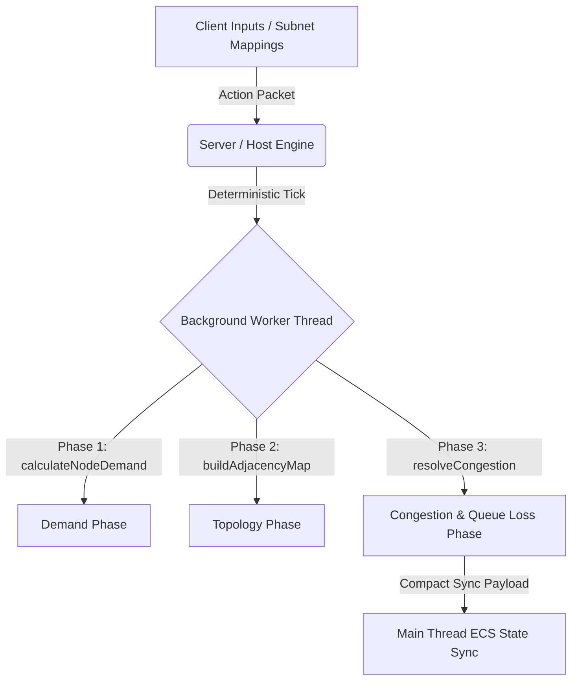

# Multiplayer Architecture Specification - Network Subsystem

This document outlines the architectural decisions and future integration blueprints to support multiplayer scalability, deterministic state synchronization, and client-side prediction reconciliation for the Network Systems Subsystem.

---

## 1. Deterministic Flow Aggregation Model

The Network Simulation Engine (orchestrated by the ECS `PacketSystem` and calculated inside background Web Workers) operates on a completely **decoupled, deterministic, and replay-safe aggregate-flow physics model**.



### Key Deterministic Rules:
1. **Separation of Sim and Render**: The UI (`CableSystem.tsx` rendering Three.js lines, node status icons) does not contribute to simulation state.
2. **Fixed Time-Step Mechanics**: Networking physics advance at a fixed physical update rate (`processTick(dt = 1.0)`).
3. **No Float Randomness**: Any dynamic latency or packet loss formulas use reproducible seed-safe mathematical caps (`toFixed(4)` rounding, `Math.min`).

---

## 2. Client-Side Prediction & State Reconciliation

In future multiplayer integrations (via WebSockets or WebRTC), latency could make real-time updates of cables or link saturation feel sluggish. To ensure a premium UX, we will implement **Client-Side Prediction**:

### Prediction Model:
- **Local Simulation**: When a player plugs a cable between two switches, the client immediately updates the local topology map, instantiates a local `ConnectionComponent`, and projects standard link speeds.
- **Server Tick Replay**: The server receives the action, verifies physical port availability, and returns a verified state tick.
- **Reconciliation Buffer**:
  ```typescript
  interface ClientStateFrame {
    tickId: number
    connections: Connection[]
  }
  ```
  If the server's synced packet loss or congestion differs from the client's predicted frame, the client reverts to the server authoritative tick and fast-forwards subsequent local inputs.

---

## 3. Multiplayer Sync Delta Payloads

To optimize network bandwidth for active sessions with hundreds of racks and servers:
1. **Delta Topology Serialization**: Instead of transmitting the full array of connections on every sync tick, clients send and receive compact binary state delta messages:
   ```typescript
   interface ConnectionStateDelta {
     id: string
     throughputGbps?: number
     latencyMs?: number
     packetLoss?: number
     status?: 'active' | 'blocked' | 'degraded'
   }
   ```
2. **Event-Driven Alerts**: State changes (like switches becoming degraded due to queue squeezes or links getting blocked by security compliance policies) publish instant lightweight broadcast messages, keeping the bandwidth footprint minimal.
